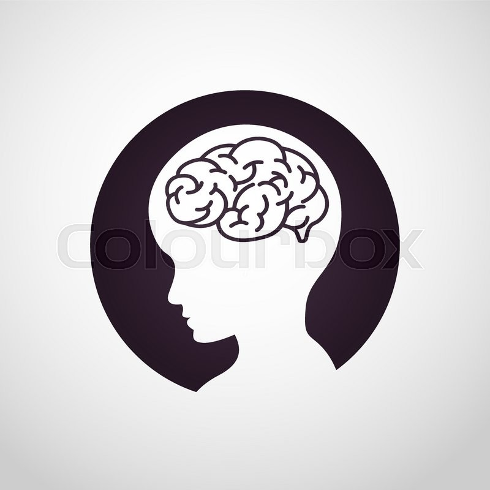

 
# MEMORY GAME

Memory game is an implementation of the classic game where the player attempts to achieve matching consecutive symbols by flipping selected cards that are initially face down.

## Game premise

The game involves a set number of cards which share a common pattern on their back while having different icons at their front. There are total of 8 different icons, with 2 or more cards having identical icons. 

These cards are initially placed in random order on a grid sequence with the symbols facing down. The player then selects these face down cards one at a time, which will flip them to reveal their underlying icons. The goal of the game is to match 2 (or more) icons from consecutively flipped cards until all icons are matched correctly.

## Game instructions

Game play proceeds as follows:

1. The player initially selects any face down card in order to flip it and reveal its underlying icon
2. The player then selects another face down card, and if there is match between the icon of this card and the previously flipped one, then both cards remain flipped.
3. Step 2 is repeated until 2 or more consecutive icons are matched; at which point all flipped cards at this point remain flipped face up permanently. The number of consecutive icons to be matched depends on the difficulty level selected (see Additional Features) --> Not implemented yet for this version
4. Should the player at any point select a card with an icon that does not match the previously flipped card, then all flipped cards at this point are flipped face down
5. The game completes when all cards are flipped face up permanently.
6. A count up timer is used to track the length of time to complete the game. 
7. A rating system is used to track the player's performance in real time. The rating metric is given by:

     **total number of cards flipped / successful icon matches**

This metric is visualized by highlighting the appropriate number of stars in the star rating icon in the game play area.

## Additional features

These features are accessible from the game icon at the upper right hand corner.

1. *Icon family*: The player can select between 3 different icon families: each family has a different set of 8 icons that follow a particular theme. This adds variety to the game play.

## Running the game

Open `index.html` directly in a browser (preferably the latest version of Chrome or Firefox) and you are all set to go !

You can also view a [demo](https://www.youtube.com/watch?v=N_MFeN0JdkM&t=411s) of the game.

## Dependencies

The game is implemented in [HTML5](https://www.w3schools.com/html/), [CSS](https://www.w3schools.com/css/default.asp) and plain [Javascript](https://www.w3schools.com/js/default.asp) 

It additionally uses a Javascript [timer library](https://github.com/husa/timer.js/). 
The [dev](https://raw.githubusercontent.com/husa/timer.js/master/dist/timer.js) file (`timer.js`) is placed in the `js` subfolder along with the main javascript file (`app.js`)

## Resources used

The following CSS resources were referenced and  modified in the styling of the following components in the game:

* [Card flip animation](https://www.w3schools.com/howto/howto_css_flip_image.asp)

* [Modal boxes](https://www.w3schools.com/howto/howto_css_modals.asp)

* [Image jitter animation](https://www.w3schools.com/howto/howto_css_shake_image.asp)

## Tests
There are no unit tests as of yet. This is work-in-progress.

## Contributing
Pull requests are welcome. For major changes, please open an issue first to discuss what you would like to change.

## License
[MIT](https://choosealicense.com/licenses/mit/)